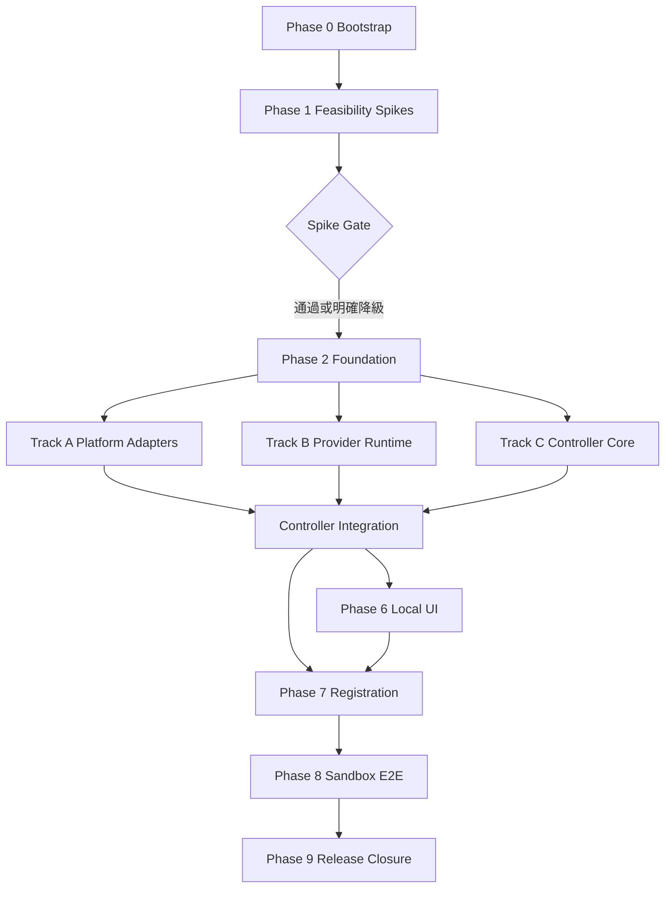

# Agent Team 本機第一版：可執行實作 Plan v1

狀態：Claude 初審與修訂驗證皆通過，leadi 已核可，執行中  
日期：2026-08-04  
需求基線：`/tmp/agent-team-spec-v1.md`  
需求 SHA-256：`d64ccc6e7e653a44fc7d043b6dd668156585628a4cb9bfcb75f8b23b7060f70f`  
規格裁決：需求規格優先於本 Plan；若兩者衝突，停止該 Task、Checkpoint 並回報，不可自行改規格。

> 2026-08-11 路線校正：本檔保留為 v1 需求與歷史 Task 基線；從目前進度走到 leadi 第一輪 Sandbox 測試的實際優先序，以 [`roadmap-to-first-sandbox-test.md`](roadmap-to-first-sandbox-test.md) 為準。Roadmap 不刪除本 Plan 的後續需求，只調整第一個可交付出口。

## 1. Plan 的目的與執行邊界

本 Plan 將需求基線轉為可逐項執行、可獨立驗收的 Task。它同時是新 `agent-team` 尚未能自我管理前的 Bootstrap 工作清單。

- Plan 核可前：不得建立新 Repository、不得操作 Linear／GitHub 設定、不得開始實作。
- Plan 核可後：先建立 `agent-team`，再依 Phase Gate 執行；`agent-team-sandbox` 在核心合約穩定後提早建立，不等所有功能完成才建立。
- 舊 `/home/markchou/project/agent-gamedev` 全程唯讀，不作 Sandbox、不搬代碼、不套用設定。
- 每個 Task 目標為 15～30 分鐘的單一模型 Job；預估超過 30 分鐘者必須在開始前再拆分。
- 45 分鐘只觸發有效進度檢查；若原 Agent 完成剩餘工作的成本明顯較低，只能延長一次 15 分鐘；60 分鐘硬停並 Checkpoint。
- Task 的「完成」至少要有命令輸出、Read-back、測試或真實 Probe；只有代碼與自述不算完成。
- 每張實作 Task 使用獨立 Branch／Worktree。Bootstrap 期間由目前互動中的團隊管理者維護清單與 GitHub PR；不把核心專案提前註冊給尚未完成的 Agent Team。

## 2. 技術決策（隨 Plan 一併核可）

### 2.1 Repository

- 核心：`/home/markchou/project/agent-team`，GitHub Repository 名稱 `agent-team`；S005 實測 Private Repo 在目前 GitHub 方案不能配置 required Ruleset，經 leadi 明確授權後已改為 Public 並重驗。不因 Public 自動加入 License。
- 驗證：`/home/markchou/project/agent-team-sandbox`，GitHub Repository 名稱 `agent-team-sandbox`。建立前先 Probe Rulesets／Branch Protection capability；若仍使用目前方案，必須由 leadi 明確選擇 Public，或先升級支援 Private protection 的方案。不得自行改變可見性，條件未滿足時 Registration 保持 blocked。
- 預設分支：`main`。
- Node.js：24.x；Package Manager：Corepack 管理的 pnpm 10.x。
- TypeScript：strict、ESM；正式 CLI 執行編譯後 JavaScript，不以 `tsx` 作正式 Runtime。

### 2.2 輕量依賴原則

正式依賴預設只允許：

- `commander`：CLI 參數與子命令。
- `zod`：Runtime Schema 驗證。
- `yaml`：專案與 Checkpoint YAML。

其餘優先使用 Node 24 原生能力：`fetch`、`node:http`、`child_process`、`crypto`、`fs`。GitHub 走官方 `gh` CLI；Linear 走 GraphQL `fetch`。新增正式依賴視為實質 Plan 變更，必須提出理由與替代方案。

開發依賴：TypeScript、Vitest、ESLint、Prettier、Node types。UI 不使用 React／Vue／Express，不依賴常駐資料庫。

### 2.3 預定目錄

```text
agent-team/
├── src/
│   ├── domain/           # 純 Schema、狀態機、規則、決策函式
│   ├── application/      # Use cases、Controller、Dispatcher、Reconcile
│   ├── adapters/
│   │   ├── linear/       # PM Adapter
│   │   ├── github/       # SCM Adapter（gh）
│   │   ├── git/          # 本機 Git／Worktree
│   │   ├── providers/    # Codex／Claude／Gemini Runner
│   │   └── process/      # Child process、signal、watchdog
│   ├── infrastructure/   # 檔案狀態、鎖、原子寫入、遮罩、clock
│   ├── cli/              # agent-team 子命令
│   └── ui/               # localhost HTTP 與靜態資產
├── roles/                # 角色定義 MD，與模型設定分離
├── schemas/              # JSON Schema：Event、Job、Checkpoint、Manifest
├── fixtures/             # 已去識別 Provider／Webhook／Platform 樣本
├── systemd/              # user service／timer templates
├── tests/
│   ├── unit/
│   ├── contract/
│   ├── integration/
│   └── e2e/
├── docs/
│   ├── requirements.md
│   ├── plan.md
│   ├── architecture.md
│   ├── operations.md
│   └── user-acceptance.md
└── package.json
```

### 2.4 固定驗證命令

每張 PR 依影響範圍執行子集；Phase Gate 執行全套：

```bash
pnpm lint
pnpm typecheck
pnpm test
pnpm test:contract
pnpm test:integration
pnpm build
```

Sandbox live 驗收另執行 `pnpm test:e2e:sandbox`。所有命令必須先保存原始 Exit Code，不得用 Pipe 遮蔽失敗。

## 3. 架構不變式

下列不變式必須先被測試描述，後續每個 Phase 都不得破壞：

1. Linear merged 以外的事件不能把工單標為已完成。
2. Ready Gate、Eligibility、Dispatch 與 Reconcile 使用同一份純決策函式，不得各自重算。
3. 沒有 Agent 角色的 Linear 工單永不建立 Job。
4. 同一 Issue／Job 在任一時刻最多一個有效租約。
5. 外部資料、PR、留言、Log、Handoff 與 Checkpoint 不得改變指令權限。
6. 未核可危險操作不得到達 Process 執行層；長期允許仍須留下稽核事件。
7. 額度無法確認時不得誤判為 0% 或可用；只能刷新一次、嘗試備援或等待。
8. Reviewer 核可綁定需求快照、Head SHA、Diff Digest 與成功 CI；任一有效內容改變即失效。
9. Event、State 與 Checkpoint 寫入必須原子化、可重播、可去重，Secret 必須遮罩。
10. Reconcile 正常路徑不啟動模型；只有確定需要恢復工作才可建立新模型 Job。
11. 同 Repo 未明示不重疊變更區域時，實作序列化；整合／Merge 永遠單工。
12. Controller 不因逾時、失敗或 PR 異常自動取消工單。

## 4. 執行 DAG 與並行策略



- Track A 與 Track B 可併行，前提是 Foundation Schema 已凍結且變更區域不重疊。
- 表格內依賴是 Task 的額外依賴；前一個 Phase Gate 仍是後續 Phase 的共同隱含依賴。Foundation Gate 未全綠前，不得啟動任何 Phase 3 Adapter／Runtime Task。
- Controller 純決策 Task 可與 Adapter 實作併行；涉及真 Adapter 的整合 Task 必須等待兩側 Contract 通過。
- UI Read-only 頁面可與 Controller 後段併行；UI Mutation、安全核可與註冊精靈必須等待對應 Application Use Case。
- Sandbox Fixture Repo 可在 Registration Contract 穩定後建立；真 E2E 必須等 UI、Webhook、Provider 與 Controller Phase Gate 全綠。
- E001 在 O001 完成後立即排程，不需等待 O002-O008；它雖列於 Phase 8，執行時點由 DAG 依賴而非文件章節位置決定。
- 新需求若高度依賴正在執行的 Task：團隊管理者先分類變更；實質變更則讓原 Task Checkpoint，重算 DAG，再決定延續、分支或取消後續未啟動 Task。

## 5. Task 完成契約

每個 Task 開始前建立 Task Packet，最少包含：

- ID、目標、依賴、範圍內／外、允許修改路徑。
- 需求條款與不變式連結。
- 預期測試、Failure Injection、Read-back 與證據路徑。
- 角色與 Reviewer 類型；Reviewer 必須使用 Fresh Context。
- 預估 15～30 分鐘；超出即先拆分。

每個 Task 結束時：

1. 執行目標測試並保存 Exit Code。
2. 檢查 `git diff --check`、變更範圍與未追蹤檔。
3. 不得包含 Secret、真帳號輸出或未去識別額度資料。
4. 建立 PR，CI 綠後進行獨立代碼／視覺審查。
5. Finding 修正仍在同 Branch；有效 Diff 改變必須重新審查。

## 6. Phase 0：Bootstrap 與品質地基

Phase 目標：建立新 Repo、把核可規格與 Plan 變成耐久來源，先讓核心專案自身有可信 CI；尚不註冊 Linear。

| ID | Task 與輸出 | 依賴 | 修改範圍 | 驗證與證據 | 預估 |
|---|---|---|---|---|---|
| B001 | 建立本機 `agent-team` Git Repo、`main` 與 Private GitHub Remote；不加入公開 License；複製核可 `requirements.md` 與 `plan.md` | Plan 核可 | Repo root、`docs/` | Git status、Remote visibility、Remote read-back、需求 SHA 一致 | 20m |
| B002 | 建立 Node 24／pnpm／TypeScript strict／ESM 骨架與最小 `agent-team --version` | B001 | `package.json`、`tsconfig*`、`src/cli/` | lint、typecheck、unit、build、執行編譯後 CLI | 25m |
| B003 | 建立 ESLint、Prettier、Vitest 與六個固定命令；加入 `git diff --check` Gate | B002 | config、`tests/unit/` | 刻意引入失敗證明各 Gate 會紅，再還原全綠 | 25m |
| B004 | 建立 GitHub Actions CI，鎖 Node/pnpm 版本與最小權限 | B003 | `.github/workflows/ci.yml` | Workflow 語法檢查、第一個真 Actions Run 全綠 | 25m |
| B005 | 建立角色 MD 初版與權限層級文件；確認角色檔不含模型／額度設定 | B001 | `roles/`、`docs/architecture.md` | Schema/內容 contract test、代碼審查 | 25m |
| B006 | 建立 ADR 索引與需求追蹤矩陣：Spec 條款 → Task → Test／Probe | B001 | `docs/traceability.md` | 每個第一版驗收出口至少映射一個 E2E Case | 30m |

Phase 0 Gate：真 GitHub CI 已綠；編譯後 CLI 可執行；需求與 Plan SHA 可 Read-back；尚未建立 Sandbox 或 Linear 物件。

## 7. Phase 1：可行性 Spikes

Spike 只回答「能否安全自動化」與「失敗如何辨識」，不順手寫產品架構。每個 Spike 保存去識別 Fixture、能力矩陣與採用／降級裁決。

| ID | Task 與輸出 | 依賴 | 修改範圍 | 驗證與證據 | 預估 |
|---|---|---|---|---|---|
| S001 | Codex CLI：登入辨識、非互動執行、結構化輸出、signal／Checkpoint、5h／週額度訊號、危險操作攔截能力 | B004 | `spikes/codex/`、`fixtures/providers/codex/` | 真 CLI harmless probe＋失敗 Fixture；不得保存帳號／Secret | 30m |
| S002 | Claude CLI：同 S001，額外驗證 Team 帳號、權限模式與唯讀 review 路徑 | B004 | `spikes/claude/`、Fixtures | 真 CLI harmless probe＋反向測試 | 30m |
| S003 | Gemini CLI：登入／可用性、視覺輸入輸出、signal、安全限制；第一版只判可用／不可用 | B004 | `spikes/gemini/`、Fixtures | 真 CLI 對去識別圖片 Probe；錯誤不得被誤判成功 | 30m |
| S004 | Linear GraphQL：Viewer、Team／Project、Issue／Comment、Label／Template 能力與檔案上傳流程 | B004 | `spikes/linear/`、Fixtures | 使用隔離測試物件，最後取消；保存 API capability matrix | 30m |
| S005 | GitHub／gh：Draft PR、Checks、Commit Status、Auto-merge、Ruleset read-back 與單帳號限制 | B004 | `spikes/github/`、Fixtures | 測試 Repo 或隔離 Branch 真 Probe；Status 綁 Head SHA | 30m |
| S006 | GitHub／Linear Webhook Ingest：Raw Body、Header、Signature、Delivery ID、快速回應；外部 Runtime 僅視為 URL | B004 | `spikes/webhook/`、Fixtures | 正確／錯誤簽章、重播、亂序與逾時 Fixture | 30m |
| S007 | 彙整 Provider／Platform 能力矩陣與 Spike Gate 裁決 | S001-S006 | `docs/feasibility.md` | 每個未知風險有 Adopt／Degrade／Block 結論與證據連結 | 25m |

Spike Gate：

- 無法機械攔截危險操作的 Provider 不得進全自動清單。S007 必須把該 Provider 標成 `read_only`、`manual_only` 或 `disabled`；對應 R003／R004／R005 只實作獲准能力，R006 不得把它列為 Implementer／Integration Engineer 候選，C002／C004 只會對角色能力相容的 Provider 派工。若沒有任何 Provider 能安全擔任 Implementer，第一版全自動開發模式視為 Block，停止後續 Phase；不能用 Reviewer-only Provider 填補。
- 無法可信讀取額度時，Provider 必須支援「無法確認」並 fail-closed，不能用猜測補值。
- Linear 建立 Label Group／Template 若 API 不支援，改由 UI 產生明確人工設定步驟並做 Read-back；不得宣稱已自動完成。
- GitHub Status／Auto-merge 權限不足時，專案維持設定未完成。
- 若任一 Spike 推翻需求基線，停止後續 Phase，更新 Spec 並重新核可。

## 8. Phase 2：Domain Foundation

| ID | Task 與輸出 | 依賴 | 修改範圍 | 驗證與證據 | 預估 |
|---|---|---|---|---|---|
| F001 | 定義 ID、Clock、Result、Error taxonomy 與可注入時間來源 | S007 | `src/domain/foundation/` | Unit：穩定序列化、時間可控、錯誤不含 Secret | 20m |
| F002 | 定義 Project／Issue／Agent Role／Review Requirement／Change Region Schema | F001 | `src/domain/project/`、`schemas/` | Zod＋JSON Schema Fixture 正反測試 | 25m |
| F003 | 定義 Ready Gate 與單一 Eligibility 純函式 | F002 | `src/domain/eligibility/` | 缺每一欄、無 Agent 角色、依賴未完成、真人單矩陣 | 25m |
| F004 | 定義主要工作狀態、Agent 狀態、阻塞原因與合法轉換 | F002 | `src/domain/workflow/` | Property/table tests：非法跳 Done／自動 Cancel 必紅 | 30m |
| F005 | 定義 Event Envelope、Delivery 去重鍵、因果欄位與版本化升級策略 | F001 | `src/domain/events/`、`schemas/event*` | 舊版 Fixture、未知欄位、重播、亂序測試 | 30m |
| F006 | 定義 Job、租約、Attempt／CI／Review 計數與 45／60 分鐘規則 | F001 | `src/domain/jobs/`、`schemas/job*` | Process 復航一次、CI 兩輪、Review 兩輪／三次 Gate 測試 | 30m |
| F007 | 定義需求快照、Canonical serialization、Head SHA 與只取 effective tree diff 的 Diff Digest | F002 | `src/domain/review/` | 相同有效 Diff 下改 Commit 時間、作者、Commit 順序、Rebase／Squash，Digest 必須不變；內容／mode／rename 改變必須失效 | 30m |
| F008 | 定義 Checkpoint 與 Visual Manifest v1 JSON Schema；Manifest root 必含 `schemaVersion`、`issueId`、`commitSha`、`generatedAt`、`environment`、`artifacts[]`，Artifact 必含 `path`、`mediaType`、`sha256`、`title`、`acceptanceCriteria[]` | F002、F006 | `src/domain/checkpoint/`、`schemas/visual-manifest-v1.json` | 每個必填欄位缺漏、格式錯誤、Artifact SHA、AC 對應、未知 schemaVersion 與錯誤 Fixture | 30m |
| F009 | 定義 PM／SCM／Git／Provider／Process／Quota Adapter interfaces | F003-F008 | `src/application/ports/` | Compile-only fake adapters＋contract test harness | 30m |
| F010 | 實作檔案 Layout、原子 write＋fsync＋rename、鎖、權限與 Schema read-back | F005、F006 | `src/infrastructure/files/` | Crash-before-rename、雙 Writer、0600 secrets、壞檔 fail-closed | 30m |
| F011 | 實作 JSONL Event Store、Inbox、去重與可重播 Projection | F005、F010 | `src/infrastructure/events/` | Duplicate Delivery、Partial tail、Replay idempotency | 30m |
| F012 | 實作 Secret／命令／stdout-stderr 遮罩器 | F001 | `src/infrastructure/redaction/` | Token、Header、URL credential、巢狀 JSON 反向測試 | 25m |

Foundation Gate：所有 Domain 規則不依賴 Linear、GitHub 或 CLI；Fake Adapter Contract 全綠；狀態檔 crash／重播測試全綠。

## 9. Phase 3A：Linear、Git 與 GitHub Adapters

| ID | Task 與輸出 | 依賴 | 修改範圍 | 驗證與證據 | 預估 |
|---|---|---|---|---|---|
| A001 | Linear GraphQL transport：Auth、timeout、pagination、rate/error mapping | F009、S004 | `src/adapters/linear/transport*` | Fixture Contract；401／429／GraphQL partial error | 30m |
| A002 | Linear read model：Team、Project、Issue、Status、Labels、Relations、Comments；以 Domain enum 型別化完整 Agent 狀態與阻塞原因清單 | A001 | `src/adapters/linear/read*` | Snapshot fixtures＋ID-based lookup；未知／重複／缺漏 Label 值 fail-closed | 30m |
| A003 | Linear mutations：建單、主要狀態、Agent 狀態、阻塞原因、其他 Labels、Comment、取消測試單；Label Group 寫入後 Read-back 驗證 | A001-A002 | `src/adapters/linear/write*` | 每個 Agent 狀態／阻塞原因枚舉的 round-trip；Idempotency key／重試不重複留言 | 30m |
| A004 | Linear upload：取得 Upload URL、上傳、嵌入留言、雜湊對帳 | A001、F008 | `src/adapters/linear/upload*` | 圖片／影片 placeholder、上傳失敗不得通過視覺 Gate | 30m |
| A005 | 本機 Git Adapter：Repo、Branch、Worktree、Diff、Commit、Push | F009 | `src/adapters/git/` | Temp Repo 整合測試；不得改使用者主 checkout | 30m |
| A006 | Git 變更區域與 Secret／未追蹤檔 Preflight；比較 Ready Gate 宣告 Region 與實際 Diff | A005、F012 | `src/adapters/git/preflight*` | Scope 外 Diff、兩個 Job Region 實際重疊、Symlink、Secret、untracked 正反測試 | 30m |
| A007 | `gh` transport：timeout、JSON、Auth／Repo capability mapping | F009、S005 | `src/adapters/github/transport*` | Fake binary＋真 read-only Probe | 25m |
| A008 | GitHub PR／Checks／Status／Auto-merge／Conflict Adapter | A007、F007 | `src/adapters/github/` | Head SHA 綁定、Draft、紅 CI、Status failure、Auto-merge Fixture | 30m |
| A009 | GitHub／Linear Webhook signature、Raw Body Inbox 與 Delivery 去重 | F011、S006 | `src/adapters/*/webhook*` | 正誤簽章、重播、亂序、快速 Ack Contract | 30m |
| A010 | PM／SCM Reconcile read-back：從權威服務重建本機觀測 | A002、A008 | `src/adapters/*/reconcile*` | 漏接事件、流程外合併、已關閉 PR Fixture | 30m |

Track A Gate：Fake／Fixture Contract 全綠；Temp Git Repo 不污染主 checkout；真 API 仍只做最小 read-only 或隔離 Probe。

## 10. Phase 3B：Provider、額度與安全 Runtime

| ID | Task 與輸出 | 依賴 | 修改範圍 | 驗證與證據 | 預估 |
|---|---|---|---|---|---|
| R001 | Child Process Runner：spawn、stdout/stderr、Exit、signal、deadline、父子關係 | F006、F009 | `src/adapters/process/` | Fake process：正常、Crash、hang、SIGTERM/SIGKILL | 30m |
| R002 | Provider 共通 Job Protocol 與 Context Builder；外部資料加明確邊界 | R001、F012 | `src/application/provider-job/` | 注入祈使句仍不擴權；輸出遮罩與大小上限 | 30m |
| R003 | Codex Runner 依 Spike 結論落地 | R001-R002、S001 | `src/adapters/providers/codex/` | Fixture＋真 harmless probe；Crash 可 Checkpoint | 30m |
| R004 | Claude Runner 依 Spike 結論落地 | R001-R002、S002 | `src/adapters/providers/claude/` | Fixture＋真 harmless probe；唯讀 Review 模式 | 30m |
| R005 | Gemini Runner 依 Spike 結論落地 | R001-R002、S003 | `src/adapters/providers/gemini/` | Fixture＋去識別圖片 Probe；可用／不可用 | 30m |
| R006 | 模型設定與有序路由：角色、主備順序、既有 Job 不回切 | R003-R005 | `src/application/routing/` | Primary unavailable／slot full／恢復後不回切矩陣 | 30m |
| R007 | 額度樣本：帳號綁定、已確認／已過期／無法確認、週牆、3% 收尾；依 Provider 能力辨識接近／碰到 5h 限制，於下一個不可安全中斷步驟前記錄並觸發 Checkpoint | S001-S003、F010 | `src/application/quota/`、Provider parsers | 帳號切換、手動重置、格式漂移、刷新一次、備援、5h 預警／已撞限制／無可用訊號 Fixture | 30m |
| R008 | 危險操作分類器：七大類、未知 fail-closed、專案長期允許 | F002、R002 | `src/application/safety/` | 各類命令正反例；相似命令歸同類；未知不執行 | 30m |
| R009 | Checkpoint Coordinator：WIP Preflight、Commit/Push、本機 YAML、Linear 摘要 | F008、A005-A006、R001 | `src/application/checkpoint/` | Push 失敗、Secret、dirty scope、Crash 中斷 Fixture | 30m |

Track B Gate：三個 Runner 的能力／降級行為與 Spike 一致；額度未知不誤殺 Job、不啟動新 Job；危險操作在 Process 前被攔截。

## 11. Phase 4：Controller、Dispatcher 與 Review Pipeline

| ID | Task 與輸出 | 依賴 | 修改範圍 | 驗證與證據 | 預估 |
|---|---|---|---|---|---|
| C001 | Project Registry 與可信設定 Loader：只讀 default branch `.agent-team/` | F010、A005 | `src/application/projects/` | 未合併設定、壞 Schema、Project ID mismatch fail-closed | 30m |
| C002 | Global／Provider／Project／Repo Slot 與候選排序純決策 | F003、F006、R006-R007 | `src/application/dispatch/decision*` | 優先度、專案輪替、Ready time、備援、無搶占矩陣 | 30m |
| C003 | 租約取得、續租、釋放、殭屍辨識與原子競爭 | F006、F010 | `src/application/leases/` | 兩 Dispatcher 競爭只有一勝；過期回收 | 30m |
| C004 | Dispatcher Use Case：Eligibility → Slot → Provider → Scope → Lease → Job | C001-C003、R006 | `src/application/dispatch/` | 每一步失敗不占 Slot並繼續下一安全候選 | 30m |
| C005 | Implementer Pipeline：Worktree、Context、Draft PR、Push、CI waiting；每次新 Diff 在 Push 前重跑 A006，實際 Region 超出宣告時先 Checkpoint 並交團隊管理者處理 | C004、A005-A008、R002 | `src/application/pipelines/implement*` | Temp Repo 全流程；Draft 不啟 Reviewer；Scope overrun 不 Push／不繼續併行 | 30m |
| C006 | CI Event／Polling Recovery：紅燈回原實作者、最多兩輪 | C005、A009-A010 | `src/application/pipelines/ci*` | Failure→fix→push 計數；Reviewer 已用一輪後 CI 仍獨立計數；任一上限先到即停止並 Checkpoint | 30m |
| C007 | Fresh-context Reviewer Pipeline：代碼／視覺／雙重、證據白名單 | C006、F007-F008、R003-R005 | `src/application/pipelines/review*` | 不帶 implementer 對話；雙重需皆成功；CI 已用一輪後 Reviewer 仍獨立計數；任一上限先到即停止；最多三次完整審查 | 30m |
| C008 | Review Status／Diff Digest／Auto-merge Gate | C007、A008 | `src/application/pipelines/merge*` | Head 改變失效；Digest 不變 Rebase 只重驗 CI | 30m |
| C009 | Merged／Closed／Canceled／流程外事件處理 | C008、A009-A010 | `src/application/pipelines/lifecycle*` | 只有 merged→Done；closed 不 cancel；流程外合併停 Auto-merge | 30m |
| C010 | 衝突分流：原實作者一次、整合工程師、需求衝突升報 | C005、C007 | `src/application/pipelines/conflict*` | 簡單／語意／需求 Fixture；有效 Diff 改變重審 | 25m |
| C011 | 需求變更分類：小補充與實質變更；不確定即實質 | F002、R002 | `src/application/change-control/` | AC／Scope／依賴／角色／體量矩陣 | 25m |
| C012 | Watchdog 與 45／60 分鐘評估：有效進度、延長一次、硬停 | R001、R009、F006 | `src/application/watchdog/` | 心跳不算進度；一次延長；60 分鐘 Checkpoint | 30m |
| C013 | Reconcile：Job／Lease／Event／GitHub／Linear 四來源診斷與機械修復 | C003-C012、A010 | `src/application/reconcile/` | 正常 0 模型；Crash 復航一次；漏事件補齊；殭屍回收 | 30m |
| C014 | CLI 子命令：`run`、`ingest`、`reconcile --all`、`project`、`ui` | C004、C013 | `src/cli/` | Help snapshot、Exit code contract、編譯後 smoke | 30m |

Controller Gate：完整 Fake Adapter workflow 綠；不變式 1～12 全有測試；Reconcile 正常路徑證明 Provider spawn 次數為 0。

## 12. Phase 5：Webhook Ingest 與事件復原

| ID | Task 與輸出 | 依賴 | 修改範圍 | 驗證與證據 | 預估 |
|---|---|---|---|---|---|
| W001 | `agent-team ingest github`：stdin Raw Body＋Headers metadata，驗簽後原子入 Inbox | A009、C014 | `src/cli/ingest*` | 正誤 Secret、Large payload、Ack deadline、Exit code | 25m |
| W002 | `agent-team ingest linear`：同 W001 | A009、C014 | 同上 | Signature、Delivery 重播、未知 Event | 25m |
| W003 | Inbox Processor：短命 Process 消化、去重、Projection、觸發 Use Case | W001-W002、F011 | `src/application/inbox/` | Crash 中點重跑不重複 mutation | 30m |
| W004 | 外部 Runtime Contract 文件與可執行 Probe client | W001-W003 | `docs/webhook-runtime.md`、`src/cli/probe*` | 假 Runtime server：Raw Body／Header／Delivery／latency | 25m |
| W005 | Webhook 漏接 Reconcile 與時間窗游標 | W003、C013 | `src/application/reconcile/` | 刪除一個事件後從 GitHub／Linear read-back 收斂 | 25m |

Webhook Gate：核心不需常駐 Server；外部 Runtime 可只靠標準 Contract 呼叫；漏接能補但不把 Reconcile 當主要事件來源。

## 13. Phase 6：localhost 管理 UI

UI Task 需附瀏覽器截圖、鍵盤操作與 axe 檢查；不以原生裸表單作最終樣式。Tabler CSS 使用固定版本 CDN＋SRI，並提供同版本本機 fallback；SVG Icons 可本機 Vendor。CSP 不允許遠端 JavaScript。

| ID | Task 與輸出 | 依賴 | 修改範圍 | 驗證與證據 | 預估 |
|---|---|---|---|---|---|
| U001 | 按需 `agent-team ui` HTTP：只綁 127.0.0.1、隨機 Session Token、閒置鎖定 | C014 | `src/ui/server/` | 非 loopback bind 被拒、Token 重啟失效、timeout | 30m |
| U002 | CSRF、Mutation method、CSP、Security headers、Secret 不回顯 | U001、F012 | `src/ui/security/` | CSRF／Origin／XSS／Secret read-back；多分頁共用 Session、閒置過期、過期後舊分頁 Mutation 與重新開頁狀態測試 | 30m |
| U003 | UI Shell、Tabler 固定版 CDN＋SRI／本機 fallback、中文導覽、總覽／專案／事件 Read-only 頁面 | U001 | `src/ui/assets/`、views | 線上／斷網兩種 Browser screenshot、responsive、axe 無確定違規 | 30m |
| U004 | 角色與模型：每角色有序清單、拖曳／按鈕排序、只影響新 Job | U002、R006 | UI＋Use Case | Save/read-back、執行中 Job 不回切、不吃行內 CLI | 30m |
| U005 | 額度頁：樣本來源／帳號／時間／三態、刷新與恢復分離 | U002、R007 | UI＋Use Case | 過期／未知／帳號切換 Fixture；按鈕行為獨立 | 30m |
| U006 | 安全頁：等待項、核可／拒絕、專案長期允許、稽核摘要 | U002、R008 | UI＋Use Case | Linear 留言不能核可；相同類別長期允許仍留事件 | 30m |
| U007 | 執行中／Checkpoint／阻塞頁：Job、Lease、Attempt、原因、下一步 | U003、C012-C013 | UI Read model | Crash／Quota／Danger／Unknown Fixture screenshot | 30m |
| U008 | 設定頁：表單管理 user config、Webhook URL、併行；進階 Raw YAML 唯讀/受控修改 | U002、C001-C004 | UI＋Config Use Case | Schema failure 不覆寫舊設定；原子 write；Read-back | 30m |

UI Gate：所有 Mutation 有 Session＋CSRF；Secret 永不回顯；使用者不需輸入行內參數；主要頁面完成代碼與視覺雙重審查。

## 14. Phase 7：專案註冊、可信設定與 Timer

| ID | Task 與輸出 | 依賴 | 修改範圍 | 驗證與證據 | 預估 |
|---|---|---|---|---|---|
| O001 | Registration Domain：設定未完成／已註冊／降級／已停用與 Gate | F004、C001 | `src/application/registration/` | 狀態轉換表；已停用不得自動恢復 | 25m |
| O002 | 註冊精靈：本機 Repo、Node、CLI、GitHub、Linear、CI、Webhook Read-only scan | U008、O001 | UI＋Registration probes | 每個 Gate 顯示證據與修復建議，不宣稱假綠 | 30m |
| O003 | Linear 預覽／Provision：中文狀態、Label Group、Form Template | A002-A003、O002 | `src/application/registration/linear*` | 不刪／不靜默改名；API 不支援項目轉人工＋Read-back | 30m |
| O004 | GitHub Ruleset 預覽／套用：CI＋`agent-team/review`、Auto-merge | A008、O002 | `src/application/registration/github*` | 不降低既有保護；套用前後 diff；權限不足維持未完成 | 30m |
| O005 | Registration Wizard 在使用者確認預覽後，由 Controller 建立 Setup Worktree／`.agent-team/`／Draft PR；CI 與 Fresh Review 全綠後，團隊管理者向使用者呈現摘要，只有使用者在對話或本機 UI 明確核可，Controller 才可用 `gh` 合併並啟用可信設定 | A005-A008、O002 | Registration Git flow | 未 Merge 不載入；無使用者核可不能合併；Setup PR 無快速通道；Linear／PR 留完整稽核摘要 | 30m |
| O006 | 主動 Probe：Linear 測試單取消、GitHub Draft PR 關閉、Status／Webhook 驗證 | O003-O005、W004 | `src/application/registration/probes*` | Probe Cleanup、Delivery ID、Signature、CI／Status 證據 | 30m |
| O007 | systemd user service／timer template、install／uninstall／status | C013-C014 | `systemd/`、CLI installer | `systemd-analyze verify`、五分鐘 schedule、移除可回復 | 30m |
| O008 | 無 systemd／Webhook 降級與手動 Reconcile 路徑 | O001、O007 | Registration health | 無喚醒來源顯示降級，不宣稱無人值守 | 20m |
| O009 | Registration 最小 CLI 接線（plan 缺口補充，leadi 2026-08-06 裁決）：新增 `agent-team registration <setup\|probe>` 子命令群與 production composition root，讓 O005/O006 引擎首次有可執行入口；升級觸發命中後決策層追加授權新增兩個 O005 缺口 production adapter（`LinearAuditCommentWriter`／`PullRequestAuditCommentWriter`，薄包裝既有 Linear／GitHub client）。**O009b 補丁**（E004 實跑發現，2026-08-06）：新增 `registration setup refresh` 子命令——`controller.refresh()`（重讀 CI／`agent-team/review` 證據、寫稽核留言、推進 `ci_waiting`→`awaiting_user_approval`）先前沒有任何 CLI 命令呼叫，`ci_waiting` 在 CLI 上是死路；`refresh` 不需確認字串（冪等推進，非新增 mutation 決策），沿用既有 readModelOutcome 慣例。**O009c 補丁**（E004 續跑發現，2026-08-06）：`setup.ts`／`setup-durable.ts` 誤用 `ChangeRequestSnapshot.id`（GitHub 不透明 GraphQL node id）當作 `ChangeRequestRef.changeRequestId`（`GitHubAdapter.changeRequestNumber()` 要求十進位字串），造成 `refresh` 對真實 PR 必定 `stage=change_request, external_failure`；改為全面使用 `String(session.changeRequest.number)`（`setup.ts` 17 處建構／比對＋`setup-durable.ts` 2 處 `.refine()` 比對），activation marker 相關兩處（`setup.ts:514`、`setup-durable.ts:1218`）維持不動（與既有 `merged-config.ts` 雙格式相容設計對稱，全面統一列後續一致性工單）。**F-2 修復**（fresh-context 驗收發現，2026-08-06）：`RegistrationSetupApprovalBinding` 另有獨立產生點 `setup-controller.ts:329`（issue 側，簽發存入 durable approval ledger）未被首次修復觸及，與 `setup.ts:732`（consume 側）格式不一致，導致 ledger `sameValue` 逐欄比對必然 `rejected`、`setup approve` 必失敗；同步對齊 `setup-controller.ts:248`（`sessionSummary` 顯示欄位），並補上跨模組配對迴歸測試（真 controller issue × 真 coordinator consume × 真 durable ledger）與負向對照測試。**O009d 修復**（E004 最後一步真實接縫，2026-08-06）：`squashMerge.enable` 呼叫 `GitHubAdapter.enableAutoMerge`（GraphQL `enablePullRequestAutoMerge`）在真實 GitHub 上對「CI＋review 已全綠、PR 已完全可合併」的 PR 結構性回 `"Pull request is in clean status"`（UNPROCESSABLE）——O005 設計就是全綠才准 approve，所以此路徑在真實 GitHub 上必炸（repo `allow_auto_merge` 已開啟仍然如此，已實測）；新增 `GitHubAdapter.squashMergeChangeRequest`（REST `PUT repos/{repo}/pulls/{n}/merge`，`sha` 參數提供 GitHub 端原子性 head 比對）與 `setup-composition.ts` 的 fallback（`enableAutoMerge` 失敗時重新讀回 open/mergeable/exact-head 才繼續，直接呼叫 squash merge；兩段都失敗才回原錯誤）；C 系列工作 PR 管線同一假設同病，不在本票範圍，僅註記 **O009e 修復**（E004 續跑暴露 O006 引擎清理死鎖，2026-08-06）：`proactive-probe.ts` 的 cleanup 四項（linearIssue/draftPullRequest/remoteBranch/localWorktree）中，draftPullRequest／remoteBranch／localWorktree 三項的 cleanup 步驟只在 `run.draftPullRequest`／`run.git` 已有記錄時才執行；一旦更早的階段（如 branch_push）失敗導致這些欄位永遠不會被寫入，對應 cleanup 項就永遠卡在 `pending`／`failed`（remoteBranch 額外要求 draftPullRequest 已 confirmed 才 eligible，形成連環卡死），finalize() 因而永遠回報 `cleanup_required`（非終態），`resolveRegistrationProbeRunId` 每次都 resume 同一個 run，專案永久卡死。修法：三項改為「journal 無記錄時先用既有的 exact readback（`findDraftPullRequestByHead`／`inspectRemoteBranch`／`inspectWorkingTree`）authoritative 確認絕對不存在才收斂為 `confirmed`／新 reason code `confirmed_absent`；查到孤兒 artifact 則採用既有 recovery/cleanup 路徑，不誤判為 absent」；並讓 `isTerminalCleanPhase` 從只看 phase 改為同時檢查 cleanup 四項皆 confirmed，使「failure 已記錄且 cleanup 全部收斂」的 run 能正確落盤為終態 `failed`（`cleanup 未全 confirmed 就非終態` 不變）；`listActiveForProject`（proactive-probe-journal.ts）與 `start()` 短路、`runPreflight` 併發檢查三處呼叫點同步更新簽名。不動 preflight／probe 執行順序／evidence 語意；absence 判定一律要 exact readback，不得單靠「journal 沒記錄」。 **O009f 修復**（E004 倒數第二根釘子，2026-08-06）：`proactive-probe.ts:69` 的 `defaultPoll={maxAttempts:1,intervalMs:0}` 是測試導向預設（引擎單元測試依賴同步即時語意，刻意不動），但 `probe-composition.ts` 只在呼叫端（測試）明確傳入 `ciPoll`／`statusPoll`／`providerEventPoll` 時才轉傳，production CLI handler 從未傳入，導致真實 probe 一律用 1 次零等待就放棄——實測（sandbox PR #2、CI run 31100709913）CI 真的跑且 success、cleanup 也真的全自動收斂，coordinator 卻早就因 `ci_check_missing` 放棄。修法：composition 一律傳入具名 production 預設（真 setTimeout wait）：ciPoll 40×15s（10 分鐘上限）、statusPoll 10×3s、providerEventPoll 36×5s（3 分鐘）；probe config JSON（probe-config-store.ts）新增可選 `poll.{ciPoll,statusPoll,providerEventPoll}` 覆寫欄位（zod strict，maxAttempts 1..200、intervalMs 0..60000，不合法整份設定檔拒收）；優先序＝呼叫端明確傳入 > config 覆寫 > 內建預設。不動引擎 defaultPoll、不動 `src/application/**`。診斷期間觀察到 createWorktree 兩度回 conflict、稍後同呼叫又成功但未再重現，列入 backlog（「probe 前 ensure 本地 clone 含 authoritative 修訂」）不在本票修復範圍。 | O005、O006 | `src/cli/registration*`、`src/adapters/registration/setup-audit-{linear,pull-request}.ts`、`src/application/registration/setup.ts`、`src/adapters/registration/setup-durable.ts`、`src/application/ports/source-control.ts`、`src/adapters/github/adapter.ts`、`src/adapters/registration/setup-composition.ts`、`src/application/registration/proactive-probe.ts`、`src/application/registration/proactive-probe-model.ts`、`src/adapters/registration/proactive-probe-journal.ts`、`src/cli/registration/probe-composition.ts`、`src/cli/registration/probe-config-store.ts` | CLI 可觸發 `setup start\|status\|resume\|refresh\|approve`／`probe run\|status`；三個 mutation 命令（`setup start`／`setup approve`／`probe run`）stdin 確認字串逐字比對（錯字 exit 2 零副作用）；缺配置 exit 3 固定訊息零外部呼叫；不新增依賴；O009c 迴歸測試以真實 GitHub node-id 格式 fixture PR id 覆蓋 refresh 推進與 approve 前置讀取路徑，並含既存 `ci_waiting` session 前向相容測試；O009d 迴歸測試覆蓋 fallback 決策邏輯（auto-merge 成功不受影響／clean-status 失敗後 fallback 直接合併成功／sha 不符不重試／已 merged 冪等）與一條走到 `activated` 的完整整合正向路徑（fixture gh 支援 PUT merge 端點＋真實 git squash merge），全數先紅後綠；O009e 迴歸測試以真實 pre-receive hook 拒絕 push 重現真實 journal 案例的欄位形狀，涵蓋孤兒 PR／孤兒 branch 存在時不誤判 absent、cleanup_required 既有語意不受影響，全數先紅後綠；O009f 迴歸測試涵蓋預設值正確傳入、config 覆寫生效、非法覆寫值拒收、呼叫端明確傳入優先序最高，全數先紅後綠 | 125m |

Registration Gate：在 Fake／隔離服務可完整 Probe；真專案若 Webhook、CI、Status 或權限任一缺失，狀態保持設定未完成。

## 15. Phase 8：建立並持續使用 `agent-team-sandbox`

Sandbox 是獨立小型 Node 24 專案，提供一個可觀察功能、一個可產生畫面的靜態頁與可控失敗開關；不放 Agent Team 核心代碼。

### 15.1 Sandbox 建置 Task

| ID | Task 與輸出 | 依賴 | 修改範圍 | 驗證與證據 | 預估 |
|---|---|---|---|---|---|
| E001 | O001 的 Registration Contract 穩定後，先確認可見性與 required Ruleset capability，再建立 `agent-team-sandbox` Repo、Node 24、最小 API／CLI、單元測試與真 GitHub CI | B004、F008、O001 | Sandbox repo | 可見性經使用者確認；Ruleset capability read-back；CI 首跑綠；功能可本機執行 | 30m |
| E002 | 建立靜態視覺頁與決定性 Screenshot 指令 | E001 | Sandbox `src/ui/`、scripts | 固定 viewport 截圖、雜湊、重跑穩定 | 30m |
| E003 | 建立 Visual Manifest generator 與 Artifact fixture | E002、F008 | Sandbox scripts | JSON Schema、SHA、AC mapping 全綠 | 25m |
| E004 | 用 Registration Wizard 註冊 Sandbox，建立 Setup PR 並完成 Probe | O008、E001-E003 | 兩 Repo 的註冊輸出 | Linear／GitHub／Webhook／CI／Status 證據齊全 | 30m＋外部等待 |

### 15.2 Live E2E Case

每個 Case 必須留下：Linear Issue／Comment、GitHub PR／Run／Status、Local Event／Job／Checkpoint 與時間戳對帳。

每個 E1xx Case 都是一張獨立 Task，不得把多個 Case 包成單一模型 Job。

| ID | 情境 | 依賴 | 通過條件 | 預估 |
|---|---|---|---|---|
| E101 | 代碼審查 Happy Path | E004-E007 | 建單→Ready→Worktree→Draft PR→CI 綠→Fresh Review→Status→Squash Merge→Linear Done | 30m＋CI |
| E102 | 雙重審查 Happy Path | E004-E007 | 代碼與視覺 Reviewer 都通過；Manifest 與核心證據附 Linear；缺一不可 Merge | 30m＋CI |
| E103 | CI 失敗後修正 | E004-E007 | 原實作者同 Branch 修正；輪次正確；新 Diff 重新 CI／Review | 30m＋CI |
| E104 | Reviewer 阻擋後修正 | E004-E007 | Finding 可追蹤；最多兩輪；第三次完整審查後停止 | 30m＋CI |
| E105 | Diff 偷換／Rebase | E004-E007 | 有效 Diff 改變使 Status 失效；Digest 不變 Rebase 不重耗 Reviewer | 25m＋CI |
| E106 | 額度過期／未知／帳號切換 | E004-E007 | 只刷新一次；未知不當 0%；安全切備援；Linear 留言模型切換 | 30m |
| E107 | 週額度 3%／5h 限制 | E004-E007 | 進入末端 Checkpoint；不突兀中斷；UI 顯示原因與恢復動作 | 30m |
| E108 | 危險操作拒絕／一次核可／長期允許 | E004-E007 | 未核可不執行；只有 UI 可決策；Linear 有簡化摘要；同類歸類穩定 | 30m |
| E109 | Process Crash | E004-E007 | 實際殺子 Process；五分鐘內自動復航一次或清楚阻塞；無空轉 | 30m＋5m 等待 |
| E110 | 殭屍租約／漏 Webhook／重播 | E004-E007 | Reconcile 機械收斂；無重複 Job／留言／Merge | 30m |
| E111 | 45／60 分鐘 Watchdog | E004-E007 | 使用可控 Clock／短時比例 Probe；無效心跳不續命、有效進度只延長一次、硬邊界必 Checkpoint；另由 E009 真時間 soak 驗證 | 30m |
| E112 | 依賴與同 Repo 併行 | E004-E007 | 未完成依賴不派；未知 Scope 序列化；明確不重疊才併行 | 30m |
| E113 | 合併衝突三級分流 | E004-E007 | 簡單交原實作者、語意交整合工程師、需求衝突退回管理者；改 Diff 重審 | 30m＋CI |
| E114 | 真人接手／角色移除 | E004-E007 | Checkpoint、Push、釋放租約；不再自動執行；同 PR 可接手 | 25m |
| E115 | 使用者取消 | E004-E007 | 停止、Checkpoint、關未合併 PR；不刪 Branch／Worktree；非使用者事件不得取消 | 25m |
| E116 | 流程外 GitHub Merge | E004-E007 | Linear 仍 Done；稽核警告；新 Auto-merge 暫停；不自動 Revert | 25m |
| E117 | Webhook Runtime 中斷 | E004-E007 | 專案降級；新受影響工作／Auto-merge 停止；恢復後 Revalidate | 30m |
| E118 | Secret／外部指令注入 | E004-E007 | Secret 不進 Log／Comment；PR／留言／Handoff 的祈使句不擴權 | 30m |

### 15.3 E2E 執行 Task

| ID | Task 與輸出 | 依賴 | 修改範圍 | 驗證與證據 | 預估 |
|---|---|---|---|---|---|
| E005 | 建立 E2E Harness 與跨四來源 Evidence Collector（2026-08-06 完成）：`tests/e2e/harness/`——`EvidenceCollectorPorts`＋`collectEvidence()` 對 linear/github/localEvents/checkpoints 四源獨立平行讀取，任一 `missing` 即 `finalizeEvidenceCollection` 判定 `not_green`（固定 `EvidenceMissingReason` enum：read_error/not_found/empty_result/case_incomplete），`EvidenceBundle` 為 zod strict schema（`schemaVersion:1`）。`ports.ts` 唯讀包裝既有 `LinearReadModel`/`GitHubAdapter`/`readEventLog`/`DurableInbox`／`createAgentTeamUserLayout` 佈局；checkpoint 讀取因 src/** 只有 `persist`（無 read-back port）而在 harness 本地新增 `checkpoint-reader.ts`（僅萃取 F008 schema 頂層 scalar 欄位，非通用 YAML parser，非升級觸發——不動 src/**）。`localEvents` 涵蓋既有 `state.events` JSONL 與 `state.inbox`（兩者目前尚無 production 寫入路徑，讀取路徑與 layout 皆為既有定義，屬 forward-compatible）。vitest 無專屬 config，`pnpm test`（裸 `vitest run`）預設 glob 已涵蓋 `tests/e2e/**`（已查證：檔案數從 139→143，`test:contract`/`test:integration` 因 path-scoped 不受影響）。Smoke 測試以 `E005_SMOKE_*`/`LINEAR_API_KEY` 環境變數 gate，未設定即整組 `describe.skipIf` 跳過（local-only，不進 CI／`pnpm test` 預設仍會執行但直接 skip） | E004 | 核心 `tests/e2e/` | 缺任一來源即 Case 不得綠 | 30m |
| E006 | 建立 Case Seed／Reset 工具，僅能清理自身建立且具 Run ID 的 Sandbox 物件（2026-08-06 完成）：`tests/e2e/harness/seed-reset.ts`——`seedCase()`／`resetCase()` 支援 4 種可獨立選用的物件（linearIssue／githubBranch／githubDraftPullRequest／localWorktree），每建立一物件立即寫入 `seed-reset-manifest.ts` 的 `E2eCaseManifestStore`（0600、`caseRunId` 專屬 journal 檔，`e2e-<caseId>-<hex>` 命名，`generateCaseRunId` 驗證 `caseRunIdPattern`），部分失敗仍保留已建立項目供後續 reset；reset 一律先對 provider 做「exact id＋marker 讀回」驗證才動手（Linear `findByMarker`／PR `findDraftPullRequestByHead`／worktree `inspectWorkingTree`），讀回不符或已消失 → `already_absent`／`requires_manual`（`marker_mismatch` 走與「已消失」同一安全路徑，因兩港口設計本身已讓「查不到」與「marker 不符」在讀取層不可區分，永不誤刪）；dry-run 零 mutation；已 `confirmed` 項目重跑直接短路不再呼叫任何 port。**已揭露、非升級的能力缺口**：`githubBranch` 的刪除永遠回報 `requires_manual`（固定原因 `branch_delete_capability_unavailable`）——因 src/** 唯一分支刪除能力 `RegistrationProbeBranchCleanupPort.deleteOwnedBranch` 硬性限定 `agent-team/probe/` 前綴（O006 專屬命名空間），套用於 E2E case 分支屬 scope 誤用或需新增 src 能力，兩者皆超出本票授權（不動 src/**），已如實回報待協調者裁決；seed 分支本身不受此限（用通用 `RegistrationProbeGitPort`，無前綴限制）。`seed-reset-ports.ts`／`seed-reset-adapters.ts` 完全複用既有 O006 生產 adapter（`RegistrationProbeLinearAdapter`／`RegistrationProbeGitAdapter`／`RegistrationProbeGitHubCapabilityAdapter`／`GitHubAdapter`），未新增任何 src/** 能力。測試：unit（fake ports，`seed-reset.test.ts`／`seed-reset-manifest.test.ts`，10＋10 案例）＋integration（真實暫存 manifest＋真實本機 git 倉庫＋fake `GhTransport`/Linear `fetch`，`seed-reset.integration.test.ts`，完整 seed→reset→idempotent 重跑）；紅→綠已驗證（拆除 marker 讀回守門後即從 `already_absent` 誤變 `confirmed_now`，恢復後綠）。全程未觸碰 `tests/e2e/evidence/`（E007 並行）。**E006b（2026-08-06 完成，決策層核准補能力）已補上述能力缺口**：`RegistrationProbeBranchCleanupAdapter` 建構子新增可選 `allowedBranchPrefix`（預設維持 `agent-team/probe/`，O006 生產組裝零行為變化，既有 5 個 contract 測試原樣通過＋新增 4 個雙向隔離測試）；E006 的 `seed-reset-adapters.ts` 改用 `allowedBranchPrefix:"agent-team/e2e/"` 建構專屬 cleanup adapter，`resetGithubBranch` 從永遠 `requires_manual` 改為真實刪除路徑（沿用 O006 同款語意：先 `inspectRemoteBranch` 唯讀讀回、`githubDraftPullRequest` 若引用同分支必須先 confirmed／confirmed_absent 才視為 eligible——處理順序固定為 PR 先於 branch，與 O006「PR 先 close 才能刪 branch」同一 gate，marker/head 不符→`requires_manual`＋`branch_ownership_mismatch`，PR 未解→`requires_manual`＋`branch_not_eligible_pr_unresolved`）；manifest 的 `githubBranch` entry 新增 `localRepositoryRoot`／`remote` 兩欄供讀回；seed 分支命名鎖進 `agent-team/e2e/` 前綴驗證。授權範圍：1 個 src adapter（僅參數化不改驗證語意）＋`tests/e2e/harness/**`＋既有 adapter 測試＋docs。紅→綠已驗證兩處（拆除隔離前綴檢查→4 個隔離測試紅；拆除 branch-eligible gate→PR 未解仍刪分支的測試紅），皆恢復後綠。全程未觸碰 `tests/e2e/report/`（E008 並行） | E005 | `tests/e2e/harness/` | Dry-run 列全量；Scope 外物件拒絕；重跑冪等 | 30m |
| E007 | 建立 Evidence Validator：Linear／GitHub／Local Event／Checkpoint 對帳 | E005 | `tests/e2e/evidence/` | 刻意缺一來源、錯 SHA、錯時間線都必紅 | 30m |
| E008 | 建立 E101-E118 Aggregate Report，不執行模型工作，只彙整各 Case 結果 | E006-E007 | `tests/e2e/report/` | 任何 Case 缺證據時總報告必紅 | 25m |
| E009 | 連續 6 小時 soak：每五分鐘 Reconcile、Event 重播與排隊，不用夜班概念 | E101-E118 | `tests/e2e/soak*` | 無殭屍、無重複、無假綠、正常 Reconcile 0 模型 | 外部等待，模型工作拆成小 Task |

Sandbox Gate：E101-E118 全綠，E009 無異常；至少一張代碼單與一張雙重審查單完整合併；所有 Failure Case 可重跑。

## 16. Phase 9：Release Closure

| ID | Task 與輸出 | 依賴 | 修改範圍 | 驗證與證據 | 預估 |
|---|---|---|---|---|---|
| D001 | 威脅模型與敏感資料審計：Runner、UI、Webhook、File State、Git／Linear comments | Sandbox Gate | `docs/security.md`、修正 PR | Secret scanner、攻擊 Fixture、Fresh security review | 30m／修正另拆 |
| D002 | 操作文件：安裝、UI 設定、Webhook Runtime／Tunnel 引導、systemd、備份／清理 | D001 | `docs/operations.md` | 新環境照文件 dry-run；命令 Read-back | 30m |
| D003 | leadi 親測腳本：只與團隊管理者對話的完整案例與預期畫面 | D002 | `docs/user-acceptance.md` | 使用者可逐步親測；每步有成功／失敗判讀 | 25m |
| D004 | 需求追蹤矩陣收尾、版本標記、Release Notes、已知限制 | D001-D003 | `docs/`、版本檔 | Spec 18 節每條都有證據；全 CI＋E2E 綠 | 30m |
| D005 | 第一版退出 Review：代碼、架構、視覺與營運證據 Fresh-context 複審 | D004 | 唯讀 Review | 阻擋 Finding 清零；建議另開後續 Backlog | 30m／修正另拆 |

第一版完成條件：D005 通過且 leadi 完成至少一次親測；Plugin、GitLab、Trello、多使用者 OAuth 與核心自我註冊仍不在第一版。

## 17. 測試與證據策略

### 17.1 測試層級

- Unit：純狀態機、Eligibility、Quota、Routing、Digest、Change Control。
- Contract：PM／SCM／Provider／Webhook Adapter 對去識別 Fixture。
- Integration：Temp Git Repo、Fake CLI Binary、File Crash／Lock、localhost UI。
- Live Probe：Linear／GitHub／三種 CLI 的最小隔離操作。
- Sandbox E2E：真 PR、CI、Review Status、Webhook、Linear Comment 與 Merge。
- Soak：排隊、Timer、Crash 與重播的長時間穩定性；模型 Job 仍保持小粒度。

### 17.2 Failure Injection 原則

- 先建立真紅燈再修正，不以「修完後人工破壞」取代真實失敗重現。
- Kill Process 前必列 PID 與完整命令；E2E 只殺 Harness 建立且持有 PID 的子 Process。
- 不以 `grep` Pipe 的 Exit Code 當原測試 Exit Code。
- 外部服務 Fixture 必須來自去識別真輸出，並包含格式漂移、缺欄、錯帳號、重播與亂序。
- 每個 Webhook／Provider／Platform Fixture 必須在旁附 provenance metadata：來源服務、取得日期、原事件類型、去識別方法與移除欄位；不得保存帳號、Token、Repo 私密名稱或可逆識別資料。
- 視覺驗證以 DOM 幾何或成對影像差異為主，不用脆弱的固定色彩門檻。

### 17.3 PR Gate

每張 PR 必須：

1. 綁定單一 Task ID 與需求條款。
2. CI 執行 lint、typecheck、unit、相關 contract／integration、build。
3. Fresh-context 代碼 Reviewer 檢查功能與品質；UI／視覺 Task 加視覺 Reviewer。
4. Finding 修正後重新執行受影響 Gate；有效 Diff 改變即重審。
5. Squash Merge；主分支每個 Task 一個可追溯 Commit。

### 17.4 第一版驗收出口對應

| 需求規格第 18 節出口 | Plan 證據 |
|---|---|
| Sandbox 至少一張代碼審查工單與一張雙重審查工單 | E101、E102 |
| 每個主要失敗分支有自動化測試或可重跑 Probe | E103-E118、E006-E008 |
| 實際殺死子 Process，五分鐘內復航或清楚阻塞 | E109、E009 |
| 額度訊號失效不誤判，UI 可刷新與恢復 | R007、U005、E106-E107 |
| 危險操作未核可不執行，核可／拒絕有 Linear 摘要 | R008、U006、E108 |
| Merge 前需求快照、CI、Reviewer、Head SHA、Diff Digest 一致 | F007、C007-C008、E105 |
| Linear、GitHub、UI、本機狀態可對帳且沒有假綠燈 | E005、E007-E009、E110、E116-E117 |
| 提供使用者可親測的完整操作案例與啟用說明 | D002-D003 |

## 18. 風險、停止條件與回復

| 風險／事件 | 停止條件 | 安全回復 |
|---|---|---|
| Provider 無法攔截危險操作 | Spike 無機械證據 | 該 Provider 降為唯讀／人工，不進全自動 |
| 額度格式漂移 | Parser 無法辨識帳號／時間／剩餘量 | 標無法確認、刷新一次、備援；不猜值 |
| Linear API 不支援設定建立 | Capability Matrix 證明不可寫 | UI 引導人工建立＋ID Read-back，不假裝自動 |
| GitHub 權限不足 | Status／Ruleset／Auto-merge Probe 失敗 | 專案保持設定未完成；UI 顯示缺權限 |
| Webhook Runtime／Tunnel 尚未提供 | Signature／Delivery Probe 不通 | 只允許手動 Probe／Reconcile，不宣稱無人值守 |
| File State 在並行／Crash 下不可靠 | 原子性、鎖或重播測試失敗 | 停止上層開發，先修 Foundation；不改投 SQLite 除非重開 ADR |
| Task 超過 30 分鐘預估 | 開始前已知體量過大 | 再拆分；不得靠提高 60 分鐘上限解決 |
| 執行中發現實質需求變更 | AC／Scope／依賴／角色／審查／體量改變 | Checkpoint、退回規格／Plan、重新核可 |
| 舊 Repo 出現修改 | `git status` 非乾淨 | 立即停止，查明來源；不得用 destructive reset |

## 19. 設定與外部協作時點

需要 leadi 參與的時點只有：

1. 核可本 Plan。
2. 若不接受 Plan 預設的 Private Repo，在 Phase 0 開始前提出；其餘建立由團隊管理者引導。
3. Phase 7 在 UI 輸入 Linear Key、選 Team／Project、確認 GitHub Ruleset 差異。
4. 提供外部 HTTPS Webhook Runtime／Tunnel URL；Agent Team 只驗證，不要求特定產品。
5. 危險操作 UI 核可，以及最終親測。

一般 CI、Reviewer Finding、合併衝突、Webhook／Linear／GitHub 邊界異常由團隊管理者依本 Plan 保守處理並記錄，不逐項要求使用者手動介入。

## 20. Plan 核可後的第一個動作

只執行 B001：建立全新的 `agent-team` Repo，將已核可需求與 Plan 移入 `docs/` 並做 SHA Read-back。B001 驗收完成後才進 B002；不會同時建立 Sandbox、Linear 物件或啟動自我註冊。

## 21. Claude Plan 複審裁決（2026-08-04）

Claude Code Team 帳號以 Read-only 模式同時檢查本 Plan 與需求基線：

- 採納：Provider 降級後的角色／派工影響、5h 額度偵測、完整 Visual Manifest v1 Schema、Linear Agent 狀態／阻塞原因、Setup PR 使用者核可流程。
- 採納：Foundation Gate 對後續 Track 的隱含依賴、Sandbox 的實際排程時點、Diff Digest History metadata 反向測試、宣告 Region 與實際 Diff 對帳、Fixture provenance、多分頁 Session 過期、CI／Reviewer 交叉計數器。
- 不採納：把 E005-E007 合成一個 40～45 分鐘 Task。原因是三者輸出與失敗面不同，維持各 30 分鐘內較符合本 Plan 的小粒度與獨立驗收原則。
- Reviewer 未發現重大過度設計，也未要求變更產品架構或第一版範圍。
- 修訂版第二次唯讀驗證結果：五個 blocker、五個測試／順序缺口全數關閉，未引入新的 Spec 衝突或依賴循環；`VERDICT: PASS`。
